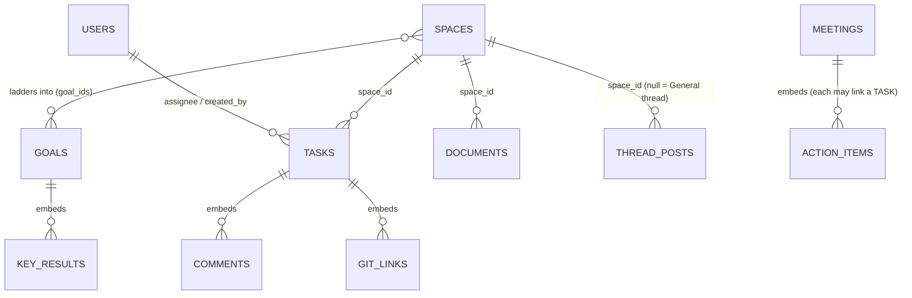

# Internal Work & Communication Tool — Design Plan

| | |
|---|---|
| **Status** | Design draft — pre-build |
| **Version** | 0.3 |
| **Date** | 2026-06-22 |
| **Audience** | Founder + the Claude Code agents implementing v1 |

### Canonical documents (read all three)

These three markdown files are the complete source of truth. There is no other spec.

1. **`internal-tool-design.md`** (this file) — product rationale, data model, invariants, and scope.
2. **`UI.md`** — the full UI/UX brief: visual language, screen-by-screen specs, component list, and demo data. Build every screen from it.
3. **`CLAUDE.md`** — engineering practices: stack, repository layout, the data-access pattern, coding conventions, and the storage-migration plan.

When the UI brief and this doc seem to disagree, this doc wins for *data and rules*; UI.md wins for *layout and interaction*.

---

## 1. Overview

### Problem

A startup under 10 people runs work across two different kinds of teams. Engineering thinks in git-linked tasks and ships code; operations, sales, and finance run ongoing *workstreams* rather than shippable projects. Today that work is scattered across an issue tracker, a docs tool, and a chat app, so no single screen answers "is the company moving?" The goal is one fast, minimal internal tool holding tasks, documents, lightweight asynchronous communication, and a meeting log — with engineering and non-engineering work tied to shared company goals.

### High-level solution

- **One object — a Space — in two modes** (`engineering` or `workstream`). Both share the same primitives (tasks, documents, a conversation thread) and differ only in defaults and the integrations layered on top.
- **Goals** are the unifying layer. Every Space attaches to one or more company goals, which is what lets engineering and non-engineering work roll up into a single founder view.
- **A personal lens ("My work")** aggregates each person's tasks (including private personal tasks), documents, and inbox across everything.
- **Threads** are the async communication surface: one conversation thread per Space, plus a single company-wide **General thread**. A *status post* inside a Space thread (with a health tag) is what feeds the Goals rollup.
- **Meetings** are a standalone, lightweight record of meetings — date, attendees, outcomes, and action items that can become tasks.

### Goals

- One source of truth for tasks and docs across engineering and non-engineering teams.
- A founder-level view that shows company goals and the latest status of every Space feeding them.
- Fast, keyboard-first capture: creating a task is near-instant.
- Minimal required input — the tool helps complete work, it isn't itself work to maintain.
- Storage that a team **without dedicated engineers** can run: schema-flexible, low-ceremony, no migration treadmill (see §4).

### Non-goals (v1)

- **Not** a real-time chat app. Communication is asynchronous: comments on tasks/docs, Space threads, one General thread, and a personal inbox. No presence or typing indicators. If real-time chat is ever needed, integrate an existing tool.
- **Not** a CRM or accounting system. Workstreams track tasks and a few manually-entered targets, not live financial or pipeline data.
- **No** granular roles/permissions in v1. Under 10 people, everyone sees everything shared; a single `is_admin` flag is enough. (Personal/private items are the one exception — see §6.)
- **No** file types beyond markdown, PDF, and images.
- **No** sprint ceremonies, capacity planning, Gantt charts, or reporting beyond the goals rollup.
- **No** external meeting integrations yet (calendar sync, transcripts). The meeting area is a manual log now, built to grow later.

### Success criteria

- A developer captures a task in two or three keystrokes and never manually updates its status once a PR is open.
- A non-engineer runs a workstream (tasks + a periodic status post) without touching anything engineering-specific.
- The founder reads the goals rollup in a couple of minutes instead of holding a status meeting.
- Adoption test: people reach for this tool before a shared doc or a chat thread.

---

## 2. Architecture & Design

### Logical model

A small set of objects, stored as documents (see §5). *Figure 1* shows the core references.

> *Figure 1: Logical relationships. Edges are references between documents; "embeds" means the child lives inside the parent document.*



### Component inventory

- **Personal screen ("My work")** — a *filtered view*, not a separate store. It reads tasks assigned to the current user across all Spaces, the user's own private tasks (which live nowhere else), the user's own and recently-edited documents, and the personal inbox.
- **Spaces hub** — an org-level screen laid out in three regions (no tabs): a **main column** listing every Space grouped by mode (info-rich rows — latest status excerpt, related goals, doc count), a **Docs rail** (all documents, grouped by Space + Personal), and the **General thread rail**. This mirrors the individual Space layout (main + Docs rail + Thread rail) so every space-like screen shares one mental model.
- **Meetings** — its own top-level area, separate from the Spaces hub.
- **Space** — the container object. `engineering` mode defaults to engineering task statuses, optional cycles, and git linking. `workstream` mode defaults to a recurring update cadence with no git concepts. The underlying record is identical; mode only changes defaults and which affordances appear.
- **Goals layer** — company-level objectives with optional key results. Spaces attach to goals; goal health is *derived* from the latest status post in each attached Space's thread, not maintained by hand.
- **Communication** — three asynchronous surfaces: comments (embedded on tasks and docs), threads (one per Space + one General thread), and the personal inbox (mentions, assignments, review requests, replies).

### Key user journeys

1. **Engineer ships a task.** Create task in a Space (title only) → open a branch named after the task → open a PR (the task links and advances to in-review) → PR merges → task moves to `done` automatically.
2. **Workstream owner reports.** A workstream with a `weekly` cadence prompts its owner → owner posts a **status post** (health + outcomes/blockers) in the Space thread → that post rolls up to every goal the Space is attached to.
3. **Founder reviews the company.** Open the Goals rollup → each objective shows its key-result numbers and the latest status post from every Space feeding it → founder comments or creates a task where a goal is stalling.
4. **Team meets.** Log a meeting (title, date, attendees) → capture outcomes → turn action items into tasks assigned to a Space/person, so the meeting feeds the work system.
5. **Anyone starts their day.** Open "My work" → clear the inbox → work through assigned tasks (shared) and personal tasks across all Spaces.

### Posture

At under 10 users this is not a scale problem; it is an adoption and latency problem. Prioritize sub-100ms interactions (optimistic updates, keyboard-first capture) over throughput. A single store is sufficient. Files (markdown/PDF/image) live in object storage or a local uploads folder; documents store only references.

---

## 3. Status Models & Field Discipline

Two product rules shape everything: **keep option sets small**, and **make everything optional except what is truly necessary.**

### Task status (minimal, mode-aware)

A single status set serves both modes. Engineering uses the full set; workstreams typically skip `in_review`. Mode hides unused states by default but does not forbid them.

| Value | Meaning | Used by |
|---|---|---|
| `backlog` | Captured, not yet committed to | both |
| `todo` | Committed, not started | both |
| `in_progress` | Being worked on | both |
| `in_review` | Awaiting review/approval | engineering (optional for workstreams) |
| `done` | Complete | both |
| `canceled` | Dropped without completing | both |

`status` always defaults to `backlog`, so the creator never has to set it.

### Other small enums (do not expand these)

- **task priority:** `low` / `medium` / `high` — optional; absent = no priority.
- **goal status:** `on_track` / `at_risk` / `off_track` / `achieved` — optional; may be derived.
- **post health:** `on_track` / `at_risk` / `off_track` (on status posts).
- **space mode:** `engineering` / `workstream` — the only hard distinction in the system.
- **thread post kind:** `message` / `status`.
- **doc type:** `note` / `spec` / `decision_log` — optional.
- **attachment kind:** `markdown` / `pdf` / `image` — the only allowed file types.
- **inbox item type:** `mention` / `assignment` / `review_request` / `comment_reply`.

### Required vs optional fields

The only fields a human must supply are the ones a record is meaningless without; everything else is optional or defaulted.

| Object | Truly required | Everything else |
|---|---|---|
| Task | `title` (a task is either in a Space or personal — see §5) | optional / defaulted |
| Space | `name`, `mode` | optional |
| Document | `owner_id` (title defaults to "Untitled", content to "") | optional |
| Goal | `title` | optional |
| Thread post | `space_id` (or null for General), `author_id`, `kind`, `body` | optional |
| Meeting | `title`, `scheduled_at` | optional |
| Comment | `author_id`, `body` | optional |

---

## 4. Technology Stack & Storage

| Layer | Choice |
|---|---|
| Frontend | **React** (TypeScript recommended) — keyboard-first SPA, optimistic updates |
| Backend | **FastAPI** (Python 3.11+), Pydantic v2 for models/validation |
| Storage (interim) | **Local JSON files** in a `local_DB/` folder — one file per collection |
| Storage (target) | **MongoDB** (preferred) — see rationale below |
| Storage (fallback) | **PostgreSQL** if a relational cluster is assigned instead |
| Files | markdown / PDF / image only; stored as references (object storage or a local `uploads/` dir). Document **bodies** are markdown, stored one file per doc as `Documents_Stage/<id>.md` at repo root (the collection holds metadata only). |

### Why a document store (and why the model below is document-shaped)

The team will not have dedicated engineers maintaining this tool. A document database (MongoDB) is the pragmatic fit: the data model maps **1:1 to JSON files now and to MongoDB collections later**, it is schema-flexible (no migration treadmill when a field is added), and embedding related data (a meeting's attendees, a task's comments) removes most joins. The cost is that the store will **not** enforce relationships or constraints for you — so the application layer must enforce the invariants in §6. That trade is acceptable for a small internal tool and is the reason the interim local-JSON phase works seamlessly: JSON files are already documents.

If PostgreSQL is chosen instead, the model maps directly: one collection → one table, embedded arrays → either child tables or `jsonb` columns, and the §6 invariants become `CHECK` constraints plus row-level security. Either way, **§5 + §6 are the contract.**

---

## 5. Data Model (document-oriented)

Each collection below is, in the interim, a JSON file under `local_DB/` containing an array of documents; later it is a MongoDB collection of the same shape. IDs are UUID v4 strings. Timestamps are ISO-8601 in UTC. Markdown is stored as raw strings. `|null` means the field is optional/nullable; `// ...` are annotations.

### users — `local_DB/users.json`
```jsonc
{
  "id": "uuid",
  "name": "string",            // required
  "email": "string",           // required, unique
  "is_admin": false,           // default false — the only "role" in v1
  "created_at": "ISO-8601"
}
```

### goals — `local_DB/goals.json`
```jsonc
{
  "id": "uuid",
  "title": "string",                       // required
  "description": "markdown|null",
  "status": "on_track|at_risk|off_track|achieved|null",  // optional; may be derived from status posts
  "target_date": "YYYY-MM-DD|null",
  "key_results": [                          // embedded, optional, bounded
    { "id": "uuid", "title": "string", "target_value": 0, "current_value": 0, "unit": "string|null" }
  ],
  "created_by": "user_id|null",
  "created_at": "ISO-8601",
  "archived_at": "ISO-8601|null"
}
```

### spaces — `local_DB/spaces.json`
```jsonc
{
  "id": "uuid",
  "name": "string",                         // required
  "mode": "engineering|workstream",         // required — the only hard distinction
  "description": "markdown|null",
  "owner_id": "user_id|null",               // recommended: a single owner
  "member_ids": ["user_id"],                // optional; everyone sees everything shared in v1
  "goal_ids": ["goal_id"],                  // M:N to goals — how work ladders up
  "update_cadence": "weekly|biweekly|monthly|null",
  "created_at": "ISO-8601",
  "archived_at": "ISO-8601|null"
}
```

### tasks — `local_DB/tasks.json`
```jsonc
{
  "id": "uuid",
  "space_id": "space_id|null",              // null = PERSONAL task, private to created_by
  "title": "string",                        // required — the only mandatory field
  "status": "backlog|todo|in_progress|in_review|done|canceled",  // default "backlog"
  "description": "markdown|null",
  "assignee_id": "user_id|null",
  "priority": "low|medium|high|null",
  "due_date": "YYYY-MM-DD|null",
  "parent_task_id": "task_id|null",         // sub-tasks
  "tag_space_id": "space_id|null",          // PRIVATE label on a personal task; NEVER affects visibility
  "git_links": [                            // embedded; engineering
    { "ref_type": "branch|pull_request|commit", "url": "string", "external_id": "string|null", "state": "open|merged|closed|null" }
  ],
  "comments": [                             // embedded
    { "id": "uuid", "author_id": "user_id", "body": "markdown", "parent_comment_id": "uuid|null", "created_at": "ISO-8601", "edited_at": "ISO-8601|null" }
  ],
  "attachments": [ { "kind": "markdown|pdf|image", "storage_key": "string", "filename": "string|null" } ],
  "created_by": "user_id|null",             // the OWNER; required for personal tasks (see §6)
  "created_at": "ISO-8601",
  "updated_at": "ISO-8601",
  "completed_at": "ISO-8601|null"           // set when status -> done
}
```

### documents — `local_DB/documents.json`
```jsonc
{
  "id": "uuid",
  "title": "string",                        // default "Untitled"
  "owner_id": "user_id",                    // required
  "space_id": "space_id|null",              // null = PERSONAL doc, private to owner
  "doc_type": "note|spec|decision_log|null",
  "url": "string|null",                     // external link (Google Sheets/Docs, Figma, Notion, …); when set, the doc is a bookmark — only the URL is stored, no bytes. Does NOT relax the attachment kinds in §3/§6.
  "content": "markdown",                    // default ""; body is stored on disk as Documents_Stage/<id>.md (one file per doc, at repo root) and injected into responses — link docs (url set) have no file
  "linked_task_ids": ["task_id"],           // bidirectional spec <-> issues
  "comments": [ /* same shape as task comments */ ],
  // A doc created by UPLOADING a pdf/image carries one attachment; its bytes live under uploads/<storage_key> (served read-only at /uploads/<storage_key>) and content is "".
  "attachments": [ { "kind": "markdown|pdf|image", "storage_key": "string", "filename": "string|null" } ],
  "created_at": "ISO-8601",
  "updated_at": "ISO-8601",
  "archived_at": "ISO-8601|null"
}
```

### thread_posts — `local_DB/thread_posts.json`
One conversation per Space, plus the single company General thread. There is no separate `threads` collection: a post's `space_id` identifies its thread.
```jsonc
{
  "id": "uuid",
  "space_id": "space_id|null",              // non-null = that Space's thread; null = the single GENERAL thread
  "author_id": "user_id",
  "kind": "message|status",                 // "status" posts carry health and feed the Goals rollup
  "body": "markdown",
  "health": "on_track|at_risk|off_track|null",  // only on kind="status"; requires space_id non-null
  "parent_post_id": "post_id|null",         // replies (messages)
  "period_label": "string|null",            // optional, e.g. "Week of 2026-06-15"
  "created_at": "ISO-8601"
}
```

### meetings — `local_DB/meetings.json`
```jsonc
{
  "id": "uuid",
  "title": "string",                        // required
  "scheduled_at": "ISO-8601",               // required — date/time
  "attendee_ids": ["user_id"],              // embedded references
  "outcomes": "markdown|null",              // the durable artifact
  "action_items": [
    { "id": "uuid", "text": "string", "done": false, "task_id": "task_id|null" }  // converting an item creates a task and links it
  ],
  "related_space_ids": ["space_id"],        // optional
  "related_goal_ids": ["goal_id"],          // optional
  "created_by": "user_id|null",
  "created_at": "ISO-8601"
}
```

### inbox_items — `local_DB/inbox_items.json`
The single personal notification surface.
```jsonc
{
  "id": "uuid",
  "user_id": "user_id",                     // recipient
  "type": "mention|assignment|review_request|comment_reply",
  "task_id": "task_id|null",
  "document_id": "document_id|null",
  "post_id": "post_id|null",
  "read_at": "ISO-8601|null",               // null = unread
  "created_at": "ISO-8601"
}
```

### cycles — DEFERRED
Engineering sprints are out of v1. When added, a `cycles` collection (`{ id, space_id, name?, starts_on, ends_on }`) plus a `cycle_id` on tasks. Reserved, not built now.

---

## 6. Invariants the Application Must Enforce

Because the store (JSON files / MongoDB) enforces nothing, the **backend** is responsible for every rule below. Enforce them in the service layer, server-side, never trusting the client. These are not optional.

1. **Task is shared or owned.** A task has either `space_id` (shared) or, if `space_id` is null, a non-null `created_by` (personal). Never persist a task with both null.
2. **Personal-task privacy.** A task with `space_id == null` is private to its `created_by`. It must appear **only** in that user's "My work" and must never be returned to any other user, in any list or search. A Space's task list is the set with `space_id == <that space>` — so personal tasks are structurally excluded from shared boards.
3. **`tag_space_id` is a label only.** It may be set only when `space_id == null`. It must never be used to include a task in a Space's task list or expose it to others.
4. **No cross-visible personal assignment.** A personal task's `assignee_id`, if set, must equal its `created_by`.
5. **Personal documents.** A document with `space_id == null` is private to `owner_id`; same visibility rule as personal tasks.
6. **Status posts.** `kind == "status"` requires a non-null `space_id` and may carry `health`. The General thread (`space_id == null`) holds `message` posts only.
7. **Goal health rollup.** For a goal, gather its Spaces (`spaces` where the goal is in `goal_ids`), then the **latest** `thread_posts` with `kind == "status"` per Space, and surface each one's `health` + body. If `goals.status` is not set manually, derive it from these.
8. **Mode is the only branch.** `space.mode` selects default statuses and which affordances show (git/cycles for engineering; cadence for workstream). It introduces no separate collections or task types.
9. **File kinds.** Only `markdown`, `pdf`, `image` attachments are accepted; reject anything else on upload.
10. **Enums are closed.** Reject values outside the sets in §3.
11. **Referential cleanup.** Deleting/archiving a Space must handle its tasks, docs, and thread posts (cascade or reassign); converting a meeting action item creates a real task and stores its `task_id` back on the item.
12. **Completion.** Setting `status` to `done` sets `completed_at`; a merged git link advances the task to `done`; an opened PR advances `todo`/`in_progress` to `in_review`.

---

## 7. v1 Scope

### In v1
- The unified **Space** object in two modes.
- **Tasks** (shared primitive) with the minimal status set and mostly-optional fields.
- **Personal (private) tasks** in "My work", optionally tagged to a Space without exposing them.
- **Documents** (markdown bodies rendered client-side + PDF/image embeds and attachments); personal or space-scoped; reachable from the Docs rail of the Spaces hub and each Space. A document may instead be an **external link bookmark** (optional `url` to Google Sheets/Docs/Slides, Figma, Notion, …) — only the link is stored, no bytes, and this does not relax the attachment kinds in §3.
- **My work** screen: inbox + my tasks (shared + personal) + my docs.
- **Spaces hub**: a three-region screen (no tabs) — grouped Spaces list + a Docs rail + the General thread rail.
- **Threads**: one conversation per Space (messages + health-tagged status posts) and one company **General thread**.
- **Goals rollup**: objectives + key results + the latest status post per attached Space.
- **Meetings**: standalone area — list + detail (date, attendees, outcomes, action-items-to-tasks).
- **Git link → task status** automation for engineering Spaces (mock the git side for the demo).

### Deferred until the pain is felt
- Cycles / sprints (model reserved).
- Additional task views (board, calendar, timeline) beyond a grouped list.
- Search beyond basic title/text matching.
- Analytics past the goals rollup.
- Roles/permissions beyond `is_admin`.
- External meeting integrations (calendar sync, attendee import, transcripts).

---

## 8. Storage & Migration Plan

1. **Now — local JSON.** `local_DB/<collection>.json`, each an array of documents matching §5. Seed with the demo data in `UI.md` §9 so the app is never empty. All access goes through a repository abstraction (see `CLAUDE.md`) so storage is swappable.
2. **Target — MongoDB.** Implement a Mongo-backed repository with the identical interface; each JSON file becomes a collection of the same documents. Migration is a one-off import script that loads each JSON array into its collection. Because shapes are identical, no transformation is needed. Flip a single config value (`STORAGE_BACKEND=mongo`) to switch.
3. **Fallback — PostgreSQL.** If a relational cluster is assigned instead: collections → tables, embedded arrays → child tables or `jsonb`, and the §6 invariants → `CHECK` constraints + row-level security (e.g. a policy that a user may read a task only when `space_id IS NOT NULL OR created_by = current_user`). The enum sets in §3 become Postgres enum types.

In all three cases the document shapes (§5) and invariants (§6) are unchanged; only the repository implementation differs.

---

## 9. Notes for Implementing Agents

- **Read UI.md for everything visual.** This doc does not describe layout, color, or interactions — UI.md does, screen by screen, with demo data.
- **IDs & time:** UUID v4 string IDs; ISO-8601 UTC timestamps everywhere.
- **Soft delete:** prefer `archived_at` over hard deletes for spaces, goals, documents. Tasks may be `canceled`.
- **Markdown:** store raw; render client-side. Never store rendered HTML.
- **Current user:** privacy (§6) depends on knowing who is asking. Thread the current user through every request. For the demo, a stubbed current user is fine; design the API so a real auth layer can wrap it later without touching the rules.
- **Optionality is a feature:** do not mark any field required that §3 does not. The create-task form accepts a title and nothing else.
- **Enforce §6 in one place** (a service/repository layer), so a single code path guarantees privacy and the other invariants rather than scattering checks across endpoints.

---

## 10. Open Questions

> [TODO: confirm — should `update_cadence` auto-generate recurring tasks, or only prompt the owner to post a status update on schedule? v1 assumes it prompts.]

> [TODO: confirm — do any workstreams (e.g. sales) want a board/pipeline view of tasks-by-status? If so, that is a *view* over the existing tasks, not a new mode or collection.]

> [TODO: confirm — final database choice (MongoDB vs PostgreSQL) once a cluster is assigned. The interim local-JSON phase is unaffected either way.]
